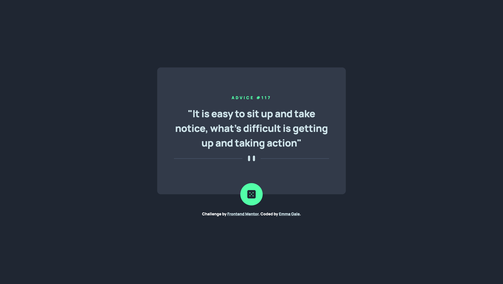

# Frontend Mentor - Advice generator app solution

This is a solution to the [Advice generator app challenge on Frontend Mentor](https://www.frontendmentor.io/challenges/advice-generator-app-QdUG-13db)

## Table of contents

- [Overview](#overview)
  - [The challenge](#the-challenge)
  - [Screenshot](#screenshot)
  - [Links](#links)
- [My process](#my-process)
  - [Built with](#built-with)
  - [What I learned](#what-i-learned)
  - [Continued development](#continued-development)
- [Author](#author)

## Overview

### The challenge

Users should be able to:

- View the optimal layout for the app depending on their device's screen size
- See hover states for all interactive elements on the page
- Generate a new piece of advice by clicking the dice icon

### Screenshot

### Links

- Solution URL: [github.com/emjogale/advice-generator](https://github.com/emjogale/advice-generator)
- Live Site URL: [advice-generator-emjogale.vercel.app](https://advice-generator-emjogale.vercel.app/)

## My process

### Built with

- Semantic HTML5 markup
- CSS custom properties
- Flexbox
- Mobile-first workflow

### What I learned

This was my first project using an external api - and I enjoyed the process

### Continued development

Next I'd like to try a project using a slightly more complex api.

## Author

- Frontend Mentor - [@emjogale](https://www.frontendmentor.io/profile/emjogale)
- Twitter - [@emmagale2635](https://www.twitter.com/emmagale2635)
